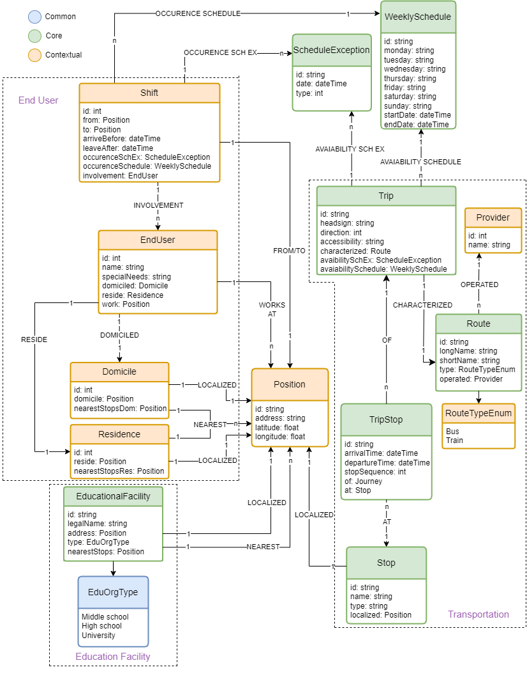
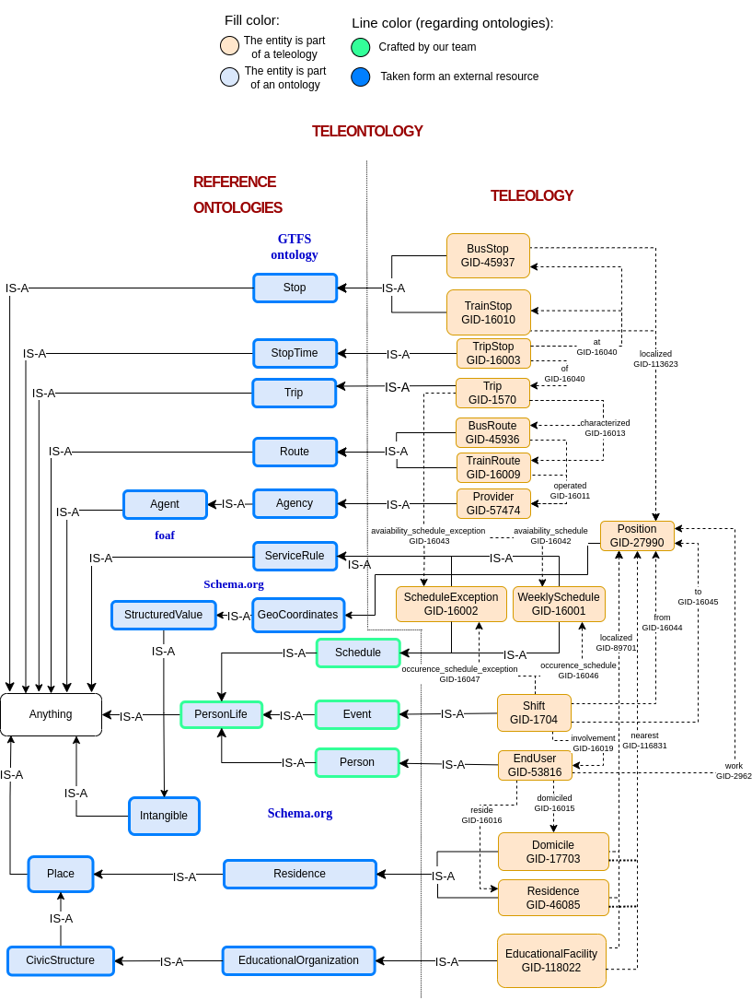
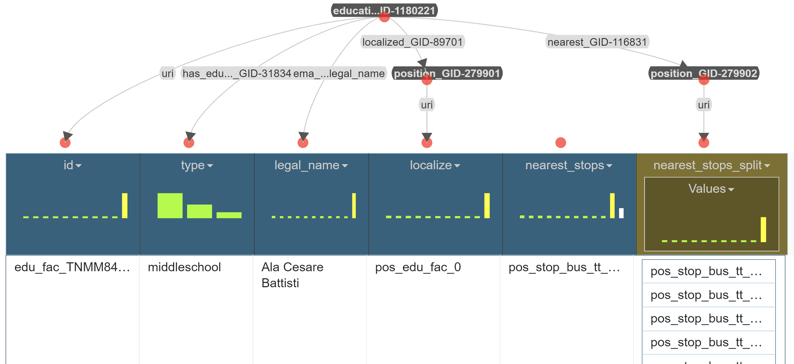

# KGE 2023 - Trentino Transportation and Education Facilities

## KGE project - Transportation & Education Facilities

This project is developed in the academic year 2023/24 for the course Knowledge Graph Engineering. 
In this page, there is the description of the work done by our team, Pasquali Thomas, and Peiretti Riccardo. Furthermore, there are links to all the resources used for this project. 

### 1. Project purpose 
The goal of this project is to build a Knowledge Graph (KG) which satisfies the many different need of students and professors to reach their middle/high-school and university by public transportation within the region of Trentino or from the main Italian cities, depending on the specific person engagements, domicile, and residence. This KG purpose is to provide data to a web/smartphone application (e.g. UniTrentoApp) for, given the user weekly educational schedule, easily and conveniently gathering information about public transportation in order to organize the most convenient trips. This purpose includes, both out-of-door and Trentino’s students, teachers that rarely have to reach Trentino.

### 2. Domain of Interest
The DoI of this project consists of two boundaries: space and time. This KGE project considers the public transportation of the region of Trentino (Italy) and main Italian cities together with Trentino education facilities over a period of time of approximately nine months between September 2023 and June 2024. 

### 3. ER Model
Considering the Domain of Interest, and the scenario created by our team, the following steps have been followed: 
1. entities identification;
2. attributes identification;
3. relationships identifiaction.

The ER-model gives an idea of the three main components of the KG: 
- EndUser 
- Education 
- Transportation
- Common 

The ER-model, at the beginning is composed by certain entities, but during the work, we refine the languge (concepts and words) employed for representing the information needed to fulfill the project purpose. The concepts are identified or created using the [kge-annotator](https://xlcpu.disi.unitn.it:30586/). For each (until now) used word/term, the tool is employed to identify the most appropriate concept by searching for synonyms or similar terms. If a sufficiently precise concept already existed in the UKC, it is adopted as is. However, in cases where concepts are either too general or completely absent, they are created as new. More details about this phase are reported in the report Phase 6 Language Definition. Below there is the final ER-model. 

 

### 4. Information gathering 
This section aims at reporting the execution of the activities involved in the Information Gathering iTelos phase. In the table below there is an explanation of where are taken the data. 

| Data source | Format | Description |
|-------------|--------|-------------|
| [E656](https://www.e656.net/) | html | This website has been scraped to obtain missing GTFS information (more on this in the next paragraphs). |
| [Wikipedia](https://it.wikipedia.org) | html | This website has been used to fetch missing data, for example [FTM](https://it.wikipedia.org/wiki/Ferrovia_Trento-Mal%C3%A9-Mezzana) stops and exact locations (more on this in the next paragraphs). |
| [PDF timetables](https://www.trentinotrasporti.it/viaggia-con-noi/ferrovia) | pdf | These timetables have been used to integrate missing data, for example the FTM trains _calendar_. |
| [Trenitalia](https://www.lefrecce.it/msite/) | - | This website has been used to check if [E656](https://www.e656.net/) data are up-to-date. |
| [Tuttitalia - Trentino](https://www.tuttitalia.it/trentino-alto-adige/19-scuole/) | csv | These datasets, obtained by activities of web scraping, contain information about middle and high schools in some municipality of the autonomous province of Trento. |
| [UniTrento Digital University](https://webapps.unitn.it/du/it/StrutturaAccademica) | csv | This dataset, obtained by activities of web scraping, contains information about faculties of the Universities of Trento, Povo, and Rovereto. |

 
Here, a summary table of the final datasets.

| Name            | Description                   |
|-----------------|-------------------------------|
| **Education** | Datasets regarding educational facilities |
| _educational\_facilities.csv_ |  This file contains information about middle/high schools and universities in the autonomous province of Trento. It is the result of the merge of _middle\_school.csv_, _high\_school.csv_, and _university.csv_. |
| **Transportation** | Datasets regarding buses and trains. For more details refer to [GTFS reference](https://gtfs.org/schedule/reference/), but recall that in this project, in some cases, files may differ from the standard. |
| _agencies.csv_ | Project-related transportation agencies information. |
| _routes.csv_ | The different "routes" an agency provides, e.g., the 5 bus route from Piazza Dante to Oltrecastello. |
| _stops.csv_ | Bus or train stops (linked to place). |
| _trip\_stops.csv_ | Stops due in different trips. |
| _trips.csv_ | Bus or Train trips. |
| **EndUser** | Datasets regarding personas. | 
| _users.csv_ | This dataset contains the information regarding a user such as domicile, residence, and the place where he works. |
| _shifts.csv_ | Users' tasks/appointments that require a _Trip_, they may or may not repeat. This file contains both geographical and temporal data. |
| **Common** | Dataset containing information from multiple of the just considered "domains". |
| _calendars.csv_ | _Transportation_: Trips weekly schedule, e.g., the trip _t_ is available on Mondays and Fridays. _EndUser_: Users shifts weekly schedule, i.e., recurring tasks/appointments. |
| _calendar\_exceptions.csv_ |  _Transportation_: Single-day modifications to trips, e.g., today the scheduled 8AM bus trip _t_ will not be available. _EndUser_: Single-day modifications to shifts. They express one-time events or exceptions like "a class has been canceled" or "today there is an extra lecture". |
| _positions.csv_ |  _Transportation_: The geographical locations of bus or train stops. _Education_: The geographical locations of schools and universities. _EndUser_: The geographical locations of users' residence and domicile. |

### 5. Knowledge definition  
The Knowledge definition is dedicated to the description of the kTelos phase. Starting from the collected project resources, the formalized purpose (partly expressed by the ER model) and the collected data, the goal is to produce the final KG’s teleontology. In particular, the knowledge resources produced in this phase aims at unifying the representation of the information, improving the interoperability and reusability of the final KG(s). By building knowledge resources reusing as much as possible well-known standard domain ontologies and data schema. 

#### 5.1 Ontology 
First of all, the goal of the _Top-Down_ knowledge definition phase is to reuse Lightweight Ontologies already aligned to the UKC to define an high-level view of the
entities involved in the project. The primary source of ontologies is [Datascientia LiveKnowledge](https://datascientiafoundation.github.io/LiveKnowledge/datasets/) with the [GTFS ontology](https://datascientiafoundation.github.io/LiveKnowledge/datasets/general-transit-feedspecification/), while [Schema.org](https://schema.org) has been used
as a fallback. However, it is necessary also to create an ontology refers to the part of the End-user, made by our team. 
Below, a table where there is the summary of the used ontologies.

| Source ontology | Entity                   |
|-----------------|--------------------------|
| GTFS ontology   | agent                    |
| GTFS ontology   | route                    |
| GTFS ontology   | service rule             |
| GTFS ontology   | stop                     |
| GTFS ontology   | trip stop                |
| GTFS ontology   | trip                     |
| Schema.org      | Residence                |
| Schema.org      | EducationalOrganization  |
| Schema.org      | GeoCoordinates           |
| Schema.org      | Place                    |
| Schema.org      | CivicStructure           |
| Schema.org      | Intangible               |
| Schema.org      | StructuredValue          |
 
#### 5.2 Teleology 
This section describes the _Bootm-Up_ knowledge definition phase of the kTelos process. The goal is to model a teleology which fits the project purpose and data, in other words, define a teleology that is aligned to the requirements to fulfill the purpose. As described in the previous sections, there are three sub-domains to consider: transportation, education and end user. Starting from the ER model and the datasets descriptions, the three sections of the teleology have been defined to reach the last part: the teleontology.

#### 5.3 Teleontology 
This section describes the _Middle-Out_ knowledge definition phase of the kTelos process. The goal
is to align the teleology (specific for this project) grounded into the Lightweight Ontology (general purpose) to generate a Teleontology which allows the reuse of this project data. In the Figure below, the final teleontology schema. 

 

### 6. Data definition 
The last phase of the metholody is the Data Definition. In this phase, the two layers Knowledge and Data are merged to form a single data structure composed by the knowledge structures defined in the last section, and the aligned dataset. Starting from the data resources cleaned and aligned, plus the teleontology, the goal is to produce a structured Knowledge Graph including both the two layers. It is necessary to handle the meaning heterogeneity to produce a KG suitable to satisfy the initial purpose. To this end, the last phase of the iTelos methodology is structured in three different activities: entity matching, entity identification, and entity mapping. Below a briefly description of these three phases. 

#### 6.1 Entity matching 
The real words entities, represented by their values, can be represented through different properties, and properties values, within different datasets. 

#### 6.2 Entity identification 
The next step is to identify an entity within a single dataset and then adopt the same type of identification, if the same entity represented in two (or more) different ways, within different datasets. For example, create a single universal dataset containg location details, including address, latitude, and longitude, for entities such as Educational Facility, End Users, and Stops. 

#### 6.3 Entity matching 
The last activity aims at concretely merging the information representation defined in the teleontology, with the relative information values in the datasets. The activity is composed by many mapping operations that concretely define the solution to the entity matching problem. More- over, a specific type of mapping operation is performed to concretely define the identifiers for the entities, to be considered the final KG. The entity mapping is performed by using the [Karma Data Integration Tool](https://github.com/usc-isi-i2/Web-Karma).

 

### 7. Conclusion  
At the conclusion of this process, we successfully build the final Knowledge Graph. Utilizing GraphDB, we formulate our queries, referred to as Competency Questions, using the SPARQL language. The Knowledge Graph is then accessible for exploration through SPARQL-based searches and visualization within the graph DB. This capability allows us to address the Competency Questions defined at the project's outset. To view the queries to fulfill the CQs, refer to phase 9.3 Query Execution in the report.  

### 8. Useful Links
For more information please check the following links:
- the complete [GitHub repository](https://github.com/ThomasPasquali/TransportationAndEducationFacilities_KGE2023)
- the full [report]()
- the [Google Drive](https://drive.google.com/drive/folders/1PUmhXYnM5fd-TqePUDAumem9luqa6qcv?usp=sharing) 
